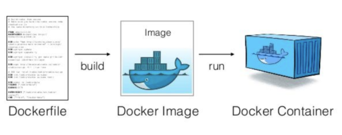

> 참고: GHOST GBC 1주차에 Programmer Base를 통해 도커에 대해 알려주신 한찬솔님께 감사드립니다.  

> 출처: [GBC_Programmer_Base](https://ccss17.github.io/ProgrammerBase/docker/#_1)  
정리에 앞서, 도커에 대한 설명이 위 출처에 상세하게 기록되어 있어 더 깊게 도커를 알아보고 싶으시면 위 출처를 참고하시기 바랍니다.  

# 도커(Docker)에 대한 설명 

도커(Docker)가 무엇인가?  
- 도커(Docker)는 컨테이너 기반의 오픈소스 가상화 플랫폼이다.  
이 도커를 통해 Windows에서 Ubuntu Linux를 사용할 수 있다.  
도커는 운영체제 자체를 가상화 시켜 사용할 수 있게 해주었다.  
- 특징은 VMWare나 VirutalBox와 달리, 시스템 리소스를 딱 필요한 만큼만 사용하여 훨씬 가볍다.  

  
도커는 위 사진과 같이,  
1. Dockerfile이라는 파일에 환경, 패키지들과 각종 셋팅(?)들을 작성해주고  
2. build를 해주어 Docker image를 생성한다.  
3. 이 image를 run하면 우리는 Dockerfile에서 설정한 환경의 Docker Container를 사용할 수 있게 된다.  

예시를 들어보자.  
만약, Dockerfile에 Ubuntu Linux에 대한 환경설정들이 되어있고, 그것을 build해서 Docker Image로 만들었다.  
그렇다면, run을 통해 우리는 Docker Container를 생성할 수 있게 되고, 이 Docker Container는 Ubuntu Linux에 대한 환경이 설정되어있다.  
즉, Ubuntu Linux의 환경 담은 가상환경이 만들어지는 것이다.  

Dockerfile을 어떻게 설정하는가?  
본인이 직접 작성해도 된다.  
나만의 커스터마이징한 Dockerfile이 만들어지는 것이다.  
예를 들어, Ubuntu Linux와 gcc, g++, Python을 설치한 나만의 Docker Image를 만들 수 있다.  

하지만, 매번 번거롭게 Dockerfile을 만들지 않아도 된다.  
이미, 누군가가 Docker Image를 만들어놓았다.  
도커 허브에서 다른 사람들이 등록한 도커 이미지를 찾아보고 사용도 가능하다.  
도커 허브에는 **Java, Python, gcc, MySQL, Ubuntu Linux, NodeJS** 등등 기업과 커뮤니티 혹은 개인들이 자신의 프로그램을 도커 이미지로 많이 만들어 놓았다.  
본인이 편한 이미지를 찾아 사용해도 무방하다.  
관심이 있다면, 직접 찾아보는 것을 추천한다.  
[도커 허브 사이트](https://hub.docker.com/)  

---

